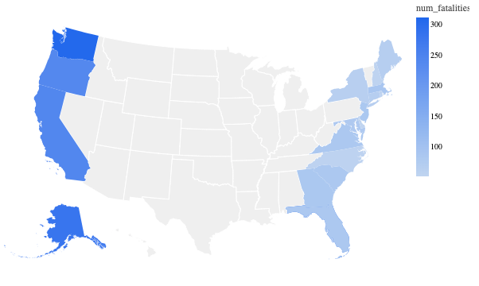

# Commercial Fishing Incident Database (CFID) Analysis

This repository contains data obtained by the [Data Liberation Project](https://www.data-liberation-project.org/), via a [Freedom of Information Act request](https://www.data-liberation-project.org/) to the Centers for Disease Control and Prevention (CDC) — NIOSH’s parent agency — and pre-processed by the Data Liberation Project.

## FOIA Records

The records provided by the CDC and NIOSH via the Data Liberation Project contain information on **fatalities and vessel disasters** in the U.S. commercial fishing industry. These records enable analysis of industry hazards and help answer questions like:
- Where are the most hazardous fisheries?
- What are the most common causes of fatalities?
- When are fatalities most likely to occur?
- Have fatalities been increasing or decreasing?
- What states have recorded the most fatalities?

## Code

This records repository contains data and analysis files related to the CFID dataset:

- [`comfishdata.csv`](comfishdata.csv), sources all the data tables for the analysis portion of this repository.
- [`commercialfishingdata.malloynb`](commercialfishingdata.malloynb), performs the data analysis using Malloy.

## Summary of Findings

The key insights from the analysis include:

### Year-over-Year Fatalities

The number of fatalities per year in the US has been steadily declining since 2000.

### Impact of Water Temperature on Fatalities

More fatalities occur when water temperature is lower.

### Fatalities in Alaska by Year

Alaska remains one of the most dangerous states for commercial fishing, with varying fatalities by year.

### Geographic Distribution of Fatalities

Hawaii, Washington, and Alaska are the top three most dangerous states to fish in.

### Fatalities by Fishery Type

Groundfish, shellfish, and pelagic fish represent the most hazardous fisheries. 

- **Most hazardous fisheries** are concentrated in specific geographic regions. The Pacific Area tends to be more dangerous than the Atlantic Area.
- **Drowning and vessel instability** are the most common causes of fatalities.
- The majority of vessel disasters involve **steel and fiberglass hull materials**, although the majority of hulls are made from these materials.
- Vessel Types classified as "Catchers" recorded the most fatalities. Similarly, Sole, Cod, and Shrimp represent the top three most fatal species fishermen are after. Deckhands were most likely to lose their life as a result of drowning. 

## Licensing

The files provided directly via FOIA (see listing above) are, as government documents, now in the public domain. All other data files have been generated for academic research and are available under Creative Commons’ [CC BY-SA 4.0 license terms](https://creativecommons.org/licenses/by-sa/4.0/). This repository’s code is available under the [MIT License terms](https://opensource.org/license/mit/).  

## Future Work

- Enhance geographic analysis with **GIS mapping**.
- Investigate **correlations between weather conditions and incidents**.
- Develop **interactive dashboards** for better data visualization.

## Acknowledgments

Special thanks to **NIOSH, CDC, and the Data Liberation Project** for making this dataset available for public research.

---

For any questions or collaborations, feel free to contact **[nbraz@zagmail.gonzaga.edu]** or submit a pull request!
